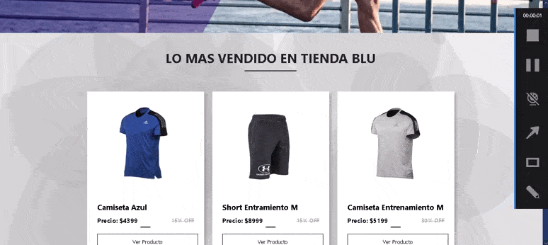

# Tienda Blu

### Tienda Blu es un e-commerce de indumentaria deportiva desarrollado en React Js donde el usuario encontrara una seccion con todo nuestra ropa disponible o si asi lo desea en su categoria correspondiente.
  

## [Link al Sitio Web](https://hard-rosario-proyecto.vercel.app/)
## Demostración del Sitio Web

  

# Este e-commerce está construido con: 💻
 

⚪ Create-React-App (React Js)
⚪ Firebase
⚪ Estilos en CSS 
⚪ Deploy en Vercel 

  

# Instalación para poder usarlo 📋
 

### 1- Instalar las dependencias de React Js. 🔧
 

〰️〰️〰️
npm i
〰️〰️〰️

 

### 2- Iniciar el servidor. 🚀
 

〰️〰️〰️
npm start
〰️〰️〰️

 

### 3- Disfrutar del Sitio Web. ✔️

 

# Creación del E-commerce 🛠️
## Components:

#### En la carpeta `components` vas a encontrar todos los componentes con los que se realizó el proyecto. Los componentes que se comunican con la base de datos de firebase son los siguientes:

* **ItemListContainer:** Utiliza la funcion de firebase ( Services/firebase.js ) para renderizar todos los productos disponibles.
 

* **ItemDetailContainer:** Utiliza la funcion de firebase ( Services/firebase.js ) para renderizar el producto seleccionado por el usuario, donde se muesta su descripcion,talle, cantidad de stock,precio y material del que esta hecho.
 

* **Checkout:** Utilizan las funciones createOrder y getUserId de firebase( Services/firebase.js ) para crear la orden de los productos que compro el usuario y enviarla a la colección **orders** que está en firebase para asi poder generar el envio del producto.

 

## Context 📄

#### En la carpeta `context/CartContext.js` se encuentra toda la lógica con la que se desarrolló el carrito de compras y las funciones para remover, agregar, vaciar productos del carrito.

 

## Firebase 📄

#### En la carpeta `Services/firebase.js` se encuentra toda la lógica con la que se desarrollaron las funciones para que aparezcan todos los productos, el producto seleccionado por el usuario, y tambien la función para crear una orden de compra con los datos del usuario y los productos que fueron comprados.

 

# Autor ✒️

Fernando Alarcon - 2021.